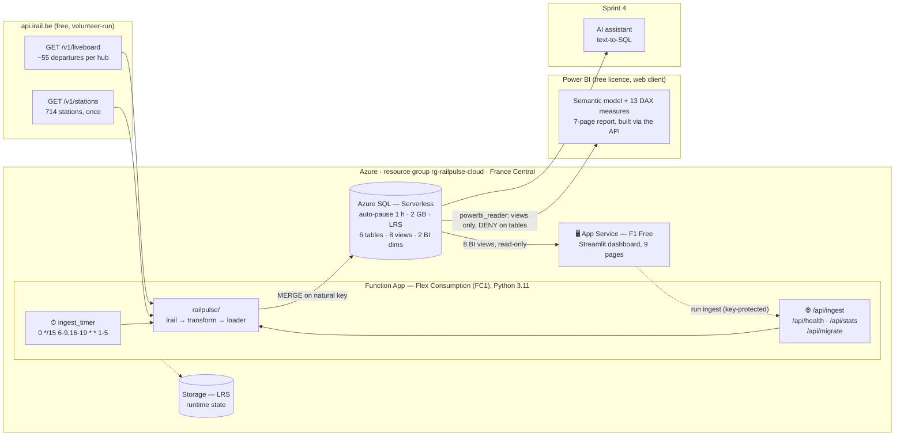
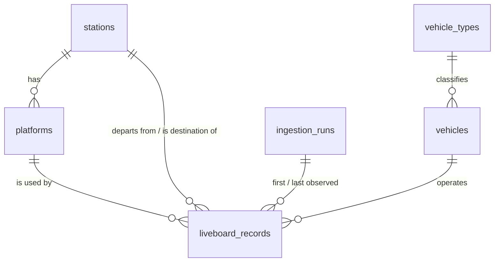

# 🚉 RailPulse Cloud — serverless liveboard ETL on Azure

> *We are RailPulse, an urban mobility consulting firm. SNCB/NMBS wants to move
> their legacy on-premise delay reporting into a modern, cloud-native
> architecture.*

An automated ETL pipeline that pulls **live departure boards** from the Belgian
rail network, normalises them into an **Azure SQL** star schema, and keeps the
whole thing inside a student subscription's free credit. It runs on a **Python
Azure Function** — one HTTP trigger for on-demand pulls, one timer trigger for
history.

**Sprint 2 of 4.** Sprint 1 ([`railpulse_sql_analysis`](https://github.com/stepvda/railpulse_sql_analysis))
normalised 2.17 M scheduled departures from the GTFS static feed into SQLite and
answered five operational questions in SQL. This sprint moves the *pipeline* to
the cloud and switches the source from a static timetable to a live feed — so
that next week's Power BI dashboard has real delays to draw.

|                        |                                                                                   |
| ---------------------- | --------------------------------------------------------------------------------- |
| **Source**             | [iRail](https://docs.irail.be/) liveboards — NMBS/SNCB data, CC BY 4.0            |
| **Warehouse**          | Azure SQL Database, General Purpose **Serverless** (1 vCore max, 0.5 min)         |
| **Compute**            | Azure Functions, Python 3.11, **Flex Consumption** (serverless)                   |
| **Grain**              | one row per scheduled departure event, upserted via `MERGE`                        |
| **Coverage**           | 10 hubs, every 15 min through the weekday peaks (Europe/Brussels)                  |
| **Cost while running** | ~$54/month, of which 97% is SQL compute · **~$0.28/month paused**                  |
| **Region**             | France Central — nearest region this student subscription's policy allows          |
| **Dashboard**          | Streamlit on App Service (F1 Free), reading the BI views                            |
| **Power BI**           | free, web client — an **8-page report generated via the API**, plus a PBIP project    |
| **Tests**              | 230, offline, ~2 s — no Azure subscription needed                                    |

---

## The architecture



Data flows one way: **fetch → parse → stage → MERGE**. The parse step is pure
functions with no I/O, which is why most of this project can be tested without an
Azure subscription.

---

## Quick start

```bash
# 0. Once: the toolchain and an offline test run
brew install azure-cli
make venv && make test           # 230 tests, no cloud needed

# 1. Create everything, with the cost settings baked in
az login                         # the @becode.education account
make provision                   # resource group, serverless SQL, storage, Function App

# 2. Ship the code
make deploy                      # zips function_app/ + sql/, remote pip install

# 3. Prove it works end to end (includes the idempotency check)
make smoke

# 4. Publish the dashboard
make web                         # provision + deploy the Streamlit app
```

Then, day to day:

```bash
make ingest      # poll every hub now
make stats       # row counts, data quality, hub leaderboard
make health      # per-station freshness
make pause       # Friday: stop the compute, keep the data
```

Prefer to click? [`docs/portal_walkthrough.md`](docs/portal_walkthrough.md) is the
same resources built by hand in the portal, blade by blade, with every
cost-critical field called out.

---

## Verified live

Deployed to `rg-railpulse-cloud` (France Central) and checked end to end by
`make smoke` — all 7 stages passed:

| stage | result |
| --- | --- |
| **dashboard** | live on App Service (F1 Free) — 9 pages over the BI views |
| schema applied | 6 tables, 8 views, 10 indexes, 15 seeded vehicle types |
| station catalogue | **714 stations** in one API call |
| first ingest, 10 hubs | **311 departures**, 10/10 hubs succeeded, 0 failed |
| **idempotency: second ingest** | **0 inserted, 311 revised** — repeated polls revise, never duplicate |
| data quality | 0.32% unknown platform · 14.79% unreported occupancy · 0 rows observed only once |
| **timer trigger** | fired on schedule and wrote **10 `trigger_source='timer'` runs** — 85 new departures, 219 revised |

A scheduled run then added 85 further departures and revised 219 existing ones,
so `liveboard_records` grew to 396 rows without a single duplicate — the timer and
the MERGE working together exactly as designed. Left to run overnight it reached
**2,440 departures across 2 days from 220 timer runs** (2,129 inserted, 4,022
revised). Twenty of those runs failed on upstream iRail HTTP 500s during one
evening peak; the retry logic recorded them honestly and **no data was lost**,
because a liveboard shows the next ~55 departures so the next poll recovers them —
verified by checking hourly coverage across the failure window.

The punctuality leaderboard on that first snapshot already separates the hubs —
Ghent-Sint-Pieters at 162.9 s mean delay and 85.7% on time, against Leuven and
Charleroi at 0.0 s and 100%. Brussels-Midi carries the most departures (56) and
the second-worst mean delay (101.5 s), which is the sprint-1 finding about
Brussels being the network's pressure point showing up again in live data.

Getting there took nine obstacles that no tutorial mentions — a region policy
banning West Europe, a Function host that could never issue an API key, an Azure
CLI command that cannot deploy to the plan Azure recommends, and a schedule
setting of mine that silently did nothing, among them.
Each one is written up with its symptom, its real cause and its fix in
**[`docs/deployment_notes.md`](docs/deployment_notes.md)**.

---

## The endpoints

Base URL: `https://<your-function-app>.azurewebsites.net`

| endpoint | auth | what it does |
| --- | --- | --- |
| `GET /api/ping` | **anonymous** | liveness. Touches **no database** — deliberately (see below) |
| `GET /api/ingest` | key | poll Brussels-Central and load it |
| `GET /api/ingest?station=Leuven` | key | poll one station by name or id |
| `POST /api/ingest?hubs=all` | key | poll all 10 configured hubs |
| `GET /api/health` | key | row counts + per-station freshness; `207` if any hub is stale |
| `GET /api/stats` | key | data-quality summary, hub leaderboard, recent runs |
| `POST /api/migrate` | key | apply `sql/*.sql` — idempotent |
| `POST /api/seed-stations` | key | load the 714-station catalogue |
| ⏱ `ingest_timer` | — | the scheduled pull |

```bash
KEY=$(az functionapp keys list -n <app> -g rg-railpulse-cloud --query functionKeys.default -o tsv)
curl -X POST -H "x-functions-key: $KEY" "https://<app>.azurewebsites.net/api/ingest?hubs=all"
```

`/api/ingest` returns **207 Multi-Status** when some hubs load and others fail. A
partial failure genuinely is neither success nor failure, and collapsing it into
`200` would leave a monitor blind to one hub that has been broken for a week.

**Why `/api/ping` is the only anonymous route, and why it never queries SQL:** a
liveness probe that touched the database every five minutes would prevent the
serverless database from ever auto-pausing, and would quietly become the largest
line on the bill. Every other route needs a function key because it either writes
to the database or spends someone else's free API quota under our `User-Agent`.

**Why the app can migrate itself.** Applying DDL from a laptop needs the Microsoft
ODBC driver installed locally *and* a firewall rule for whatever IP you have
today. The Function App already has both. `POST /api/migrate` is therefore a
convenience, not the only route — the same files run fine from the portal's Query
editor, from VS Code, or from `scripts/local_cli.py`.

---

## The dashboard

A Streamlit app on App Service reading the BI views — the live counterpart to
sprint 1's dashboard over the static timetable. Nine pages:

| page | what it answers |
| --- | --- |
| Overview | KPI header, departures by local hour, delay distribution, a map of the network |
| Live departures | one row per departure event, filterable; shows delay growth and platform changes |
| Hub leaderboard | which city runs the most reliable station — **unanswerable in sprint 1** |
| Peak hours | sprint 1's Q1 on live data, normalised by days observed |
| Platform bottlenecks | sprint 1's Q2 on live data, plus the three-Brussels-stations comparison |
| Delay evolution | did the delay grow as departure approached? Repeat offenders, minutes of notice |
| Services & destinations | service-class punctuality, busiest destinations, morning-only toggle |
| Data quality | what is missing, as a number |
| Pipeline | per-station freshness, insert-vs-revise proof, and one button to trigger a load |

**The anti-drift seam moved down a layer.** Last week every figure came from a
statement loaded *verbatim* out of a graded `.sql` file, so report and deliverable
could not disagree. That does not transfer to interactive pages — a parameterised
query is not a file you can paste into a client. So instead, **every statement in
`webapp/queries.py` reads a view from [`sql/03_views.sql`](sql/03_views.sql)**,
which is where the definitions live: what counts as on time, whether a
cancellation is in the denominator, which local hour a departure belongs to. The
dashboard cannot disagree with the warehouse because it never computes them — and
Power BI in sprint 3 will connect to the same views and agree by construction.
A test (`test_the_dashboard_reads_views_not_base_tables`) fails if a future query
goes round them.

What carried over: **every figure has a "Show the SQL" expander**, pandas is a
carrier and nothing more (no groupby, merge, pivot or mask anywhere in `webapp/`),
and the app is **read-only by construction** — `data.query` refuses any statement
that is not a `SELECT`/`WITH`, which is a hard stop rather than a convention
because the connection it holds does have write permission.

The one control that changes state is the Pipeline page's **Run ingest now**
button. It calls the Function App's key-protected endpoint; the key lives in an
App Service setting and never reaches the browser. Unset it and the button is
replaced by a note — the right default for a public URL.

Full rationale, including why last week's 980 MB SQLite pages are not deployed:
**[`docs/webapp.md`](docs/webapp.md)**.

---

## The schema

Six tables: one fact, four dimensions, one audit log. Full rationale — every
column, every constraint, every rejected alternative — in
**[`docs/schema.md`](docs/schema.md)**.



| table | grain | rows/day |
| --- | --- | --- |
| `liveboard_records` | **one scheduled departure event** | ~5 000 |
| `stations` | station (714, seeded in one API call) | — |
| `platforms` | station × platform, **discovered** as used | — |
| `vehicles` | train run (`BE.NMBS.IC1832`) | ~1 500 |
| `vehicle_types` | service class, **self-extending** | 15 |
| `ingestion_runs` | one API call + load | ~320 |

### The decision that shapes everything: the grain

A liveboard returns the *next ~55 departures*. Poll every 15 minutes and the 17:42
to Antwerp comes back a dozen times, its delay changing. Two models were possible:

|  | append every observation | **one row per departure event** ← chosen |
| --- | --- | --- |
| rows after a week | ~12× | 1× |
| "how many trains left today?" | `ROW_NUMBER() … = 1` in every query | `COUNT(*)` |
| re-running the same poll | duplicates everything | no-op |
| delay trajectory | full | first and last only |

The second, with the observation metadata kept **on the row** —
`first_seen_utc`, `last_seen_utc`, `observation_count`, and `delay_first_seen_s`
beside the current `delay_seconds`. So the interesting question survives:

```sql
-- Which trains were fine when we first saw them and fell apart later?
SELECT vehicle_name, station_name, delay_first_seen_s, delay_seconds, delay_growth_s
FROM   dbo.v_departures
WHERE  delay_growth_s > 300
ORDER BY delay_growth_s DESC;
```

What is lost is the *intermediate* trajectory: 0 → 3 → 9 → 4 minutes is recorded
as 0, 4, "seen four times". Accepted because the database is capped at 2 GB and the
consumer is a dashboard, not a forecasting model — and stated here rather than
discovered later.

### Idempotency: one MERGE, three details

The nice-to-have asks that "recurring timer runs don't corrupt your dataset".
Every load is a single `MERGE` on the natural key
`(station_id, vehicle_id, scheduled_departure_utc)`:

1. **`WITH (HOLDLOCK)`** — without it, MERGE is documented as racy: two concurrent
   runs can both find no row and both insert. The timer and a manual `POST` can
   genuinely overlap.
2. **`WHEN MATCHED AND t.last_seen_run_id <> s.run_id`** — replaying the *same* run
   is a true no-op, so a retry cannot inflate `observation_count`. A genuinely
   later poll does increment it.
3. **The source is deduplicated first**, and the drops are *counted* into
   `rows_skipped`. MERGE raises error 8672 and abandons the entire statement if two
   source rows match one target row, so one repeated departure would otherwise
   fail the whole load.

`make smoke` proves it against the live deployment: **run the ingest twice and the
second run reports `rows_updated > 0` with almost no inserts.**

### Three details worth a second look

**Cancellations are `NULL`, not zero.** `is_on_time_2min` / `is_on_time_6min` are
`NULL` for a cancelled train, so `COUNT(is_on_time_6min)` — the natural
denominator — excludes cancellations automatically, in every query, without
anyone remembering `WHERE is_canceled = 0`. A cancelled train is not late; it is
absent. Counting it as a 0-second delay would flatter the operator.

**Local time is a stored column, not a conversion.** "Which hour is busiest" is a
question about the clock on the platform wall. `AT TIME ZONE` is non-deterministic
in Azure SQL, so it cannot be a `PERSISTED` computed column and cannot be indexed.
`scheduled_departure_local` is computed once in the loader with `zoneinfo`, and a
test asserts **+1 in January and +2 in July** so a future "simplification" to a
fixed offset fails the suite instead of silently moving the answer by an hour.

**The type reference table extends itself.** A service class the project has never
seen is inserted with `is_seeded = 0` rather than failing the foreign key. New
data must never be able to stop the pipeline; it should surface as an undocumented
code in `v_vehicle_type_performance`. Reject bad data, never unfamiliar data.

### The BI contract

Next week's dashboard connects to views, never to base tables — `v_departures`
(the wide flat one), `v_station_punctuality`, `v_hourly_pressure`,
`v_platform_pressure`, `v_delay_distribution`, `v_vehicle_type_performance`,
`v_ingestion_health`, `v_data_quality`. A view is the seam that lets the physical
model change without breaking someone else's report, and it is where the
*definitions* live — what counts as on time, whether a cancellation is in the
denominator. Encoded once, so two dashboards cannot quietly disagree.

---

## Static + real-time, combined

Everything above is **observation**: a row exists because the pipeline saw a
departure. That leaves one question unanswerable, and it is the one that governs
how every other figure should be read — *when an hour is empty, was there no
train, or was nobody looking?*

Sprint 1's static GTFS timetable is that missing denominator. `sql/06_schedule_baseline.sql`
and `scripts/load_schedule_baseline.py` load the slice that can actually be
compared — the polled hubs, on the dates already observed — and join it to the
live data.

**The two id systems meet on the UIC code.** Sprint 1 is GTFS
(`gs:nmbssncb:S8813003`), sprint 2 is iRail (`BE.NMBS.008813003`). Both embed it,
which is why `stations.uic_code` is a column of its own — 01_schema.sql calls it
"the join key to any other European rail dataset", and this is that debt being
collected.

What the combination reveals, on 21,904 scheduled departures across four days:

| | |
| --- | --- |
| matched by **time + train number** | 5,490 (95.6% of all matches — a confident join, not a coincidence) |
| matched on time alone | 252 (reported separately, because it is weaker evidence) |
| **coverage during sampled hours** | **74.0%** — 5,742 of 7,758 scheduled |
| **scheduled in hours never sampled** | **14,146** — trains that ran unwatched, now counted instead of invisible |
| departures that left from a platform other than the published one | **651** |

That last row is the clearest example of why combining beats either source: the
timetable knows the *planned* platform, the live feed knows the *actual* one, and
neither alone can tell you a train was moved.

All of it is on the dashboard's **Schedule vs reality** page — scheduled against
observed for all 24 hours, with the unwatched hours marked, so the blind spot is
visible rather than implied.

Two honest caveats. `silent_cancellation_candidates` counts trains scheduled in a
sampled hour that never appeared — but a liveboard only shows the next ~55
departures, so an hour marked "sampled" is often only partly covered, and that
number is currently dominated by sampling gaps rather than real cancellations.
And only the polled hubs are loaded, so this is not a national coverage figure.

**Also worth knowing:** the join exposed a bug in its own first version. A LEFT
JOIN on (station, scheduled minute) *fans out* — Brussels-Central has a 00:25 to
Liège and a 00:25 to Ostende — and it returned 24,874 rows for 21,904 scheduled
departures, inflating every denominator by 14%. Caught because those two numbers
disagreed. It now uses `OUTER APPLY ... TOP 1`, preferring a train-number match,
and a test fails if anyone puts the LEFT JOIN back.

---

## Power BI

A free path to Power BI over the same warehouse, from the **web client** — Power
BI Desktop is Windows-only and this project is developed on macOS. The
`@becode.education` account already holds a `POWER_BI_STANDARD` (Free) licence,
verified via Graph, so nothing needs buying. Full guide:
**[`docs/powerbi.md`](docs/powerbi.md)**.

**There is no URL that pre-wires a Power BI web connection to a database** — the
only pre-filled-connection artifact Power BI has is a `.pbids` file, which opens
Desktop. So there are two routes, and `make bi-report` is the one that produces a
link:

| | **scripted** (`make bi-report`) | **Azure SQL connection** (interactive) |
| --- | --- | --- |
| gives you | an 8-page report, built | a live, self-refreshing model |
| data | snapshot — re-run to refresh | Import + scheduled refresh |
| licence | Free ✅ | Free ✅ |

### The report is generated, not hand-built

Because Power BI Desktop is Windows-only, the alternative to writing a
click-by-click guide was to build the report through the API.
[`scripts/build_powerbi_report.py`](scripts/build_powerbi_report.py) creates the
semantic model, its **16 DAX measures**, both relationships, the data, a custom
theme, and **8 pages / 104 visuals** — then verifies the numbers against the
warehouse.

The measures live **on the model, not in each visual**, so every visual shares one
definition of "on time" — the same argument the views make in SQL and
`powerbi_reader` makes in permissions.

Verified by asking **Power BI's own DAX engine** through `executeQueries` and
comparing every figure with Azure SQL, rather than trusting the upload:

```
measure             Azure SQL       Power BI      measure          Azure SQL   Power BI
Departures          8907.0000      8907.0000      DelayMinutes        7489.0     7489.0
OnTimeRate             0.9264         0.9264      Cancelled             18.0       18.0
OnTime6                0.9648         0.9648      PlatChg              987.0      987.0
MeanDelayMin           0.8425         0.8425                       all 7 agree
```

Getting the report format right took three attempts, all returning the same
`MissingDefinitionParts`: a Fabric Report whose `definition.pbir` declares
`"version": "1.0"` selects the **legacy** layout and wants a single root-level
`report.json` — not the enhanced `definition/pages/…` part set, and not no layout
at all. Inside it, `config` and `filters` are JSON-encoded **strings**; passing a
real object is accepted silently and renders a blank report. That is exactly the
kind of failure a test has to catch, so
[`tests/test_powerbi_report.py`](tests/test_powerbi_report.py) pins all of it —
29 tests, each confirmed to fail when its invariant is deliberately broken.

---

## 📊 The dashboard: design choices, and why

Eight pages, ordered as a story: **how are we doing → when does it break → what
breaks → where → who**. Every page carries a navigation bar, so a stakeholder is
never more than one click from any other view.

| # | Page | The question it answers | Why it looks the way it does |
|---|---|---|---|
| 1 | **Executive scorecard** | Is the network on time? | One KPI is deliberately 4× the size of the others. The board asked for On-Time Rate; visual hierarchy should say which number matters. The 6-minute rate sits next to it because a network can look excellent at 6 min and mediocre at 2 — showing both makes the gap legible instead of letting the threshold choice flatter the result. |
| 2 | **Rush hour matrix** | *When* does it break? | Volume and delay share **one pair of axes**, not two charts. An hour is only a bottleneck when both are high; a busy punctual hour and a quiet late hour need opposite responses, and side-by-side charts hide that. Bars are *departures per day observed*, never a raw count — see below. |
| 3 | **Train class breakdown** | *What* breaks? | Two rankings side by side, because the brief's question ("which class accounts for the most delayed minutes") is a **sum** and the obvious alternative is a **mean** — and they disagree completely. InterCity tops the total through volume; ICE tops the average at 13.6 min/train. Showing one would send the operator after the wrong class. |
| 4 | **Platform congestion** | *Where* does it break? | The station slicer is load-bearing, not decoration: "platform 5" pooled across ten hubs averages unrelated tracks and means nothing. Pick a station first — the page says so in the chart title. |
| 5 | **Hub comparison** | *Who* runs best? | On-time rate and mean delay are charted **separately and adjacently**, because they disagree and the disagreement is the insight: Liège has a high mean but a good rate (few, severe delays); Brussels-Central has a lower mean and the worst rate (many, small ones). Different failure modes, different fixes. |
| 6 | **Delay evolution** | Do delays grow while you wait? | Only answerable because the pipeline re-polls the same departure — first reading against latest. |
| 7 | **Services & destinations** | Which routes carry the pain? | |
| 8 | **Data quality & pipeline** | Should I trust any of this? | **On the report, not in an appendix.** The capture window is partial by design; a reader who does not know that will over-read every other page. |

**The one rule that shapes every hourly figure.** The timer samples weekday peak
windows harder than the rest of the day, so a raw departure count per hour would
report *the capture schedule* as the peak — circular. Every hourly chart uses
`Departures per day` (normalised by days observed) instead, and a test fails the
build if a raw count ever reaches a Rush hour chart.

**Colour is used for one thing only:** green = on time, red = delay or
cancellation, amber = attention, navy = neutral volume. No visual uses colour
decoratively, so a red bar always means the same thing on every page.

---

## 🚦 Top 3 tactical recommendations for the operator

From 8,907 observed departures across 10 hubs. Each is backed by a figure the
dashboard shows, not an impression.

> ### 1. Move recovery margin from the morning peak to the evening peak
> The evening peak runs **1.69× worse** than the morning: **69.3 s** mean delay
> (16:00–19:00) against **41.1 s** (06:00–09:00) — and it does so on **16% fewer
> trains** (3,280 vs 3,902). 18:00 is the worst hour on the network at **102.2 s**
> across 721 departures. The timetable pads both peaks alike; the delay is not.
> **Do:** shift turnaround and buffer minutes out of the morning and into
> 17:00–19:00 departures.
>
> ### 2. Fix the Brussels junction as one system, not three stations
> Brussels-Central, Midi and North are **46.1% of departures but 60.4% of all
> delay minutes**. Brussels-Central has the network's **worst on-time rate
> (89.1%)** despite a *lower* mean delay (60.9 s) than Liège (80.8 s) — the
> signature of many small delays rather than a few big ones, which is a
> dwell-time and headway problem, not an incident problem.
> **Do:** target dwell and headway on the North–Central–Midi spine; per-station
> initiatives will keep missing it, because the constraint is the link.
>
> ### 3. Ring-fence the international platforms at Brussels-Midi
> International services are **5.1% of departures but 24.1% of all delay minutes**
> (ICE averages **13.6 min** and Eurostar **5.8 min**, against InterCity's
> **0.7 min**). At Midi this concentrates geographically: platforms that are 40%+
> international run **115–273 s** late, while every platform with **no**
> international traffic runs **23–85 s** — a **10× spread inside one station**.
> **Do:** isolate international arrivals from domestic platform turns at Midi so
> imported delay stops propagating into the domestic timetable.

**The honest caveat, which the dashboard itself shows.** These rest on six days of
weekday-peak sampling. The Data quality page is on the report precisely so nobody
reads a 3-departure hour as a trend — the low-volume hours (05:00, 11:00, 15:00)
are sampling edges, not findings, which is why every recommendation above is drawn
from the 9 hours with 700+ observations. The pipeline keeps collecting, so a rerun
will move these figures slightly; all of them come from one 8,907-departure
snapshot.

Three things were added on the Azure side to make it correct rather than merely
possible:

**A contiguous date dimension.** `dim_date` (730 days) and `dim_hour` (24 rows) in
[`sql/05_bi_dimensions.sql`](sql/05_bi_dimensions.sql). Not decoration: DAX time
intelligence *requires* a gap-free date table, and because the pipeline samples
only weekday peak windows, gaps are the normal case here. Grouping on the fact's
own date column would divide "departures per day" by the days that happen to have
data rather than the days in the period. `dim_hour` exists so a chart shows all 24
hours — without it the unsampled small hours silently vanish and the network looks
like it stops at midnight.

**A least-privilege login.** `scripts/create_bi_reader.py` creates
`powerbi_reader` with SELECT on the **eight views and two dimensions only**, plus
an explicit `DENY` on every base table. Verified by connecting as it: it reads all
11 BI objects, and is refused on `liveboard_records`, on every other base table,
and on every write. This turns the project's central design claim — *the views are
the BI contract, where every metric is defined* — into a permission Power BI
cannot route around, even if someone writes a query that tries.

**Import, not DirectQuery.** The one decision that matters for cost. Measured
spend is €5.19, of which **99.8% is the database**, and the whole model depends on
that serverless database being asleep most of the time. A DirectQuery report keeps
it awake for as long as it is open:

| mode | database awake | est. cost |
| --- | --- | --- |
| **Import**, refresh 2×/day | ~2 minutes | **~€0** |
| DirectQuery, used through the day | 8–10 h/day | ~€50–78/month |
| DirectQuery with auto-refresh | 24 h/day | ~€190/month |

The honest limit: a **Free licence cannot share a report**. It lives in My
Workspace and only you can open it — screen-share it, start the free 60-day Pro
trial, or point people at the Streamlit dashboard, which needs no licence at all.

---

## Cost: the requirement that contradicts itself

The brief asks for a timer **every 15 or 30 minutes** *and* an auto-pause delay of
**exactly one hour**. Round the clock, those cannot both hold: a timer every 15
minutes means the database is never idle for an hour, so it never pauses, so it
bills ~0.5 vCore continuously — **~$190/month**, and the $100 credit is gone in
about two weeks.

This project resolves it by sampling the **weekday peaks** at 15-minute
resolution and letting the database sleep the rest of the time:

| schedule | DB awake/weekday | est. compute | credit lasts |
| --- | --- | --- | --- |
| every 15 min, 24/7 | 24 h | ~$190/mo | ~2 weeks |
| every 60 min, 24/7 | 24 h *(still never idles an hour)* | ~$190/mo | ~2 weeks |
| **15 min, 06–09 + 16–19, Mon–Fri** ← default | ~9.5 h | **~$54/mo** | ~2 months |
| paused (`make pause`) | 0 h | **~$0.28/mo** | indefinitely |

Note rows 1 and 2: **hourly polling costs the same as 15-minute polling** and
collects a quarter of the data. Within a capture window the cadence is free — what
costs money is the width of the window plus the one-hour pause tail. Anyone
reaching for "poll less often to save money" without checking the pause threshold
makes the dataset worse for nothing.

The schedule is an app setting (`INGEST_SCHEDULE`), so the trade is an operational
decision with the bill in view, not a redeploy. Full arithmetic, the settings that
matter, and the buffered-write design a production version would use:
**[`docs/cost_control.md`](docs/cost_control.md)**.

---

## Running on a paused database

This is the cloud-specific problem that most of `railpulse/database.py` exists to
solve, and it is worth stating because code written as if Azure SQL were an
ordinary database fails every single morning.

When the first timer run of the day connects, the database is **paused**. The
connection does not queue — it fails, typically with error **40613** ("Database is
not currently available"), while the platform starts a resume that takes 30–60
seconds. Then for a few seconds it may throttle (40501, 10928/10929), and a
platform reconfiguration can drop a live connection (40197, 4060).

None of those are bugs and none should lose a poll. So:

* `Connection Timeout=60` in the connection string — a 30-second default turns
  every cold start into a failure;
* transient faults are classified by SQL error number **and** ODBC SQLSTATE
  (a resume timeout arrives as `HYT00` with error number 0), and retried with
  exponential backoff on a **fresh** connection, because the old handle is dead;
* a wrong password (18456) or a missing table (208) is **not** transient and fails
  immediately — retrying it five times only turns a clear failure into a slow one.

---

## Repository layout

```
├── function_app/                 # the deployment root — this is /home/site/wwwroot
│   ├── function_app.py           # triggers: 6 HTTP + 1 timer
│   ├── host.json                 # 9-min timeout, retry policy, extension bundle
│   ├── requirements.txt          # azure-functions, pyodbc, requests, tzdata
│   └── railpulse/
│       ├── config.py             # every env var, read once, secret never logged
│       ├── hubs.py               # 10 verified station ids + the RAILPULSE_HUBS override
│       ├── irail.py              # the only module that touches the network
│       ├── transform.py          # JSON → typed rows. Pure. No I/O, no clock.
│       ├── database.py           # connections, transient-fault retry, GO splitting
│       ├── loader.py             # staging tables + the MERGE statements
│       ├── pipeline.py           # orchestration, transactions, the audit trail
│       ├── migrations.py         # applying sql/*.sql
│       └── reporting.py          # read-only snapshots for /health and /stats
├── sql/
│   ├── 01_schema.sql             # 6 tables, idempotent DDL
│   ├── 02_indexes.sql            # 10 indexes, 3 of them filtered; FK support
│   ├── 03_views.sql              # the 8 BI views
│   ├── 04_seed_reference.sql     # vehicle_types
│   ├── 05_bi_dimensions.sql      # dim_date + dim_hour, for Power BI
│   ├── 06_schedule_baseline.sql  # the static timetable, joined to observations
│   └── analysis/                 # sprint-1 questions, re-asked on live data
├── azure/
│   ├── provision.sh              # every resource, cost settings baked in, idempotent
│   ├── deploy.sh                 # package + zip deploy with remote build
│   ├── smoke_test.sh             # 7 checks incl. the idempotency test
│   └── teardown.sh               # pause (keeps data) | delete
├── webapp/                       # the Streamlit dashboard (App Service)
│   ├── app.py                    # 10 pages; a renderer, no analysis
│   ├── data.py                   # pymssql, read-only by construction
│   ├── queries.py                # every statement, all over the BI views
│   └── startup.sh                # the App Service entry point
├── scripts/
│   ├── local_cli.py              # run the pipeline / the analysis SQL from a laptop
│   ├── create_bi_reader.py       # least-privilege SQL login for Power BI
│   ├── publish_powerbi_dataset.py# push the warehouse into Power BI
│   ├── build_powerbi_report.py   # generate the 8-page Power BI report
│   ├── export_pbip.py            # write powerbi/ as a committable PBIP project
│   └── load_schedule_baseline.py # load sprint 1's timetable as a baseline
├── tests/                        # 230 offline tests + 3 recorded API payloads
└── docs/
    ├── schema.md                 # the schema, at length
    ├── cost_control.md           # the arithmetic
    ├── portal_walkthrough.md     # the manual build, blade by blade
    ├── webapp.md                 # the dashboard: what changed from sprint 1
    ├── powerbi.md                # free Power BI over the warehouse, web client
    ├── deployment_notes.md       # the 10 things that fought back, and why
    └── api_notes.md              # the API contract and its six quirks
```

---

## Tests

```bash
make test        # 118 tests, 0.2 s, no network, no Azure, no ODBC driver
```

Three groups, each aimed at a class of mistake rather than at a function:

**`test_transform.py`** — parsing, against **recorded** payloads from the live API
rather than hand-written samples. Every quirk defended against is present because
the feed really does it: numbers as strings, `"?"` platforms, `S32` types,
occupancy nested in an object, a one-element array collapsed to a bare object.
The load-bearing assertions are that the polled station becomes the *origin* and
not the destination, that `time` stays the schedule and `delay` stays separate,
that nothing vanishes silently (`kept + dropped == returned`), and the DST test
above.

**`test_hubs_and_client.py`** — the hub ids are pinned because of a real mistake
caught during development: UIC `008844008` was assumed to be Charleroi-Central and
is in fact **Verviers-Central**. That error does not raise — it returns a
perfectly plausible liveboard for the wrong city. The client tests use a fake
session: a test that calls `api.irail.be` is slow, consumes someone else's free
quota, and fails on a train.

**`test_sql_contract.py`** — the one that earns its keep. The DDL lives in
`.sql` files, the INSERT and UPDATE lists live in Python strings, and nothing
connects them: a rename that misses one side fails at run time, in the cloud,
inside a MERGE. These tests parse both sides and compare them — every column the
loader writes must exist in the schema, every column it reads must exist in the
staging DDL, the MERGE's `ON` clause must match the `UNIQUE` constraint, every
MERGE must hold `HOLDLOCK`, `first_seen_*` must never appear in an `UPDATE SET`,
and no view may `SUM` a `BIT` (T-SQL cannot). They cannot prove the SQL is
correct — only a real database can — but they catch the drift that actually
happens.

---

## How this maps to the brief

| requirement | where |
| --- | --- |
| **Must**: serverless Azure SQL, firewall for local IP + Azure services | `azure/provision.sh` §2–4 · [walkthrough §2](docs/portal_walkthrough.md#2-azure-sql-database--the--cost-critical-blade) |
| **Must**: schema with `stations`, `vehicles`, `liveboard_records`, real types and relationships | [`sql/01_schema.sql`](sql/01_schema.sql) · [`docs/schema.md`](docs/schema.md) |
| **Must**: Python 3.10+ Function App, Consumption, HTTP trigger hitting a major hub | `function_app.py:ingest` — defaults to Brussels-Central. Runs on **Flex** Consumption, not the classic Y1 plan; both are serverless pay-per-execution, and [why](docs/deployment_notes.md#5-the-linux-consumption-host-could-not-issue-function-keys--the-blocker) |
| **Must**: connection string in Environment variables, read via `os.environ` | `railpulse/config.py` — the only module that reads the environment |
| **Must**: comprehensive README on the schema choice | this file + [`docs/schema.md`](docs/schema.md) |
| **Nice**: timer trigger, CRON | `function_app.py:ingest_timer`, `INGEST_SCHEDULE` |
| **Nice**: idempotency, no duplicates on recurring runs | `MERGE` on the natural key; verified by `make smoke` step 5 |
| **Nice**: multi-hub | 10 verified hubs in `railpulse/hubs.py`, extendable by app setting |
| **Cost**: serverless everywhere, auto-pause configured | `provision.sh`, and [why 24/7 polling breaks it](docs/cost_control.md) |
| **Code**: clean modular functions | 9 modules split so that the parsing layer has no I/O and is testable offline |

---

## Limitations, honestly

* **The dataset is a sample, not a census.** The default schedule captures weekday
  peaks. Any "busiest hour" figure must be normalised by days observed per hour
  (`v_hourly_pressure.departures_per_day` does this) — a raw `COUNT(*)` per hour
  would report the *capture schedule* as the peak, which is circular.
  `sql/analysis/a1_peak_hour.sql` is written around that.
* **Delays are read at the last observation, not at departure.** A departure whose
  last sighting was 10 minutes before it left carries the delay predicted then.
  `has_left` marks the ones confirmed departed; `observed_once` in
  `v_data_quality` counts the ones that never had a chance to be revised.
* **Occupancy is crowd-sourced** by iRail's app users — sparse and
  self-selecting. `pct_occupancy_unknown` is the number that says whether it is
  worth reading.
* **Alerts are counted, not stored.** The liveboard is fetched with
  `alerts=true`, and `alerts_seen` reaches the run log, but the text is not
  shredded into tables. Multilingual alert text is a 1NF problem needing two more
  tables, and no observed payload has carried one yet.
* **Arrivals, train composition, and intermediate stops are out of scope** — each
  needs one API call *per train* against a free volunteer-run service.
* **Dimensions are SCD type 1.** A renamed station loses its old name;
  `first_seen_utc`/`last_seen_utc` are the only history.
* **No CI.** `make redeploy` runs compile + tests before publishing, which is the
  same guard by hand. A GitHub Actions workflow is a 20-line addition and the
  obvious next step.

---

## Data source and licence

Departure data from **[iRail](https://docs.irail.be/)**, which republishes
NMBS/SNCB open data under **CC BY 4.0**. Any published output should credit:

> Data: [iRail](https://irail.be) / NMBS-SNCB, CC BY 4.0.

iRail is free and volunteer-run. This client identifies itself with a contactable
`User-Agent`, keeps 0.4 s between requests (iRail asks for under 3/second), makes
~320 requests/day, and retries only genuinely transient statuses. See
[`docs/api_notes.md`](docs/api_notes.md).

Code in this repository: MIT.
