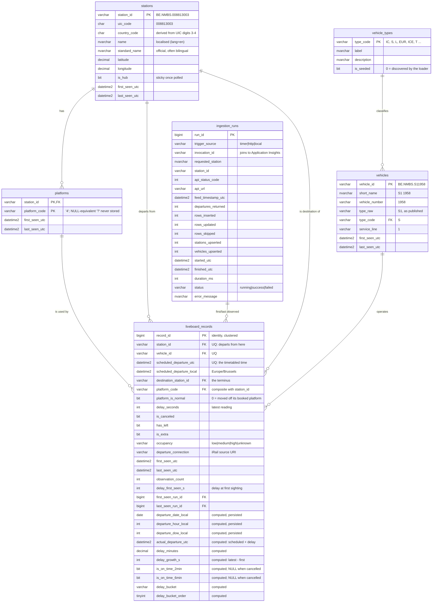

# Database schema — what it looks like and why

> The brief asks for "a comprehensive README detailing your database schema
> choice". This is that, at length. The [README](../README.md#the-schema) has the
> short version.

---

## The diagram



Six tables: one fact, four dimensions, one audit log. It is a **star schema**, and
saying so is a claim worth defending — see [Star, not snowflake](#star-not-snowflake).

---

## The decision that shapes everything: the grain

**`liveboard_records` holds one row per scheduled departure event** — one row per
(station polled, vehicle, scheduled departure time). Not one row per API
observation.

This matters because the source is not a set of records; it is a *repeatedly
observed window*. A liveboard call to Brussels-Central returns the next ~55
departures. Poll every 15 minutes and the 17:42 to Antwerp comes back in roughly
a dozen consecutive responses, its delay possibly changing each time. Two models
were available:

| | append every observation | one row per departure event |
|---|---|---|
| rows after a week | ~12× | 1× |
| "how many trains left Brussels today?" | needs `ROW_NUMBER() … = 1` in every query | `COUNT(*)` |
| delay trajectory | full | first and last only |
| a re-run of the same poll | duplicates everything | no-op |
| BI tool connecting directly | needs a semantic layer first | works as-is |

This schema takes the second, and buys back most of the first's advantage by
keeping the observation metadata **on the row**: `first_seen_utc`,
`last_seen_utc`, `observation_count`, and `delay_first_seen_s` beside the current
`delay_seconds`. So the interesting question — *did this delay grow as departure
approached, or was it late from the start?* — is still answerable:

```sql
SELECT delay_first_seen_s, delay_seconds, delay_growth_s, observation_count
FROM   dbo.liveboard_records
WHERE  delay_growth_s > 300;    -- got 5+ minutes worse after we first saw it
```

**What is genuinely lost:** the intermediate trajectory. If a delay went
0 → 3 → 9 → 4 minutes, this schema records 0, 4 and "we saw it four times". It
cannot reconstruct the 9.

**Why that trade is the right one here:** the database is capped at 2 GB by the
cost constraints, the downstream consumer is a BI dashboard rather than a
forecasting model, and the append-only design pushes a correctness burden onto
every future query — the SQL sprint's real-time tables needed
`ROW_NUMBER() OVER (PARTITION BY trip, date, stop ORDER BY snapshot DESC) = 1` in
a view precisely so that nobody would forget it. Here that burden is discharged
once, in the MERGE.

**When it would be the wrong trade:** if the goal became predicting delays, the
trajectory would be the signal, and the honest move would be a second
append-only `departure_observations` table alongside this one, not a change to
this table's grain.

### The natural key, and why it is those three columns

```sql
CONSTRAINT uq_liveboard_records
    UNIQUE (station_id, vehicle_id, scheduled_departure_utc)
```

A given train, at a given station, at a given timetabled minute, is one event in
the world. Three near-misses were considered and rejected:

* **`departure_connection` alone** — iRail's own URI,
  `.../connections/8813003/20260727/S11958`, which encodes station, date and
  vehicle. Tempting, but its resolution is the *date*, not the minute: a
  circular or shuttle service calling twice at the same station on the same day
  would collide. It is kept as an attribute for traceability, not as a key.
* **A hash of the payload** — changes whenever the delay changes, which is the
  opposite of what a key must do.
* **`(station_id, scheduled_departure_utc)`** — two trains can be booked to leave
  the same station in the same minute from different platforms. Rare, but a key
  that is "almost always unique" fails at 03:00 with a constraint violation.

`scheduled_departure_utc` rather than the local column, deliberately: the local
time repeats itself for one hour on the October DST switch, so a key built on it
would reject a legitimate departure once a year.

---

## Why a current-state fact table can still be idempotent

Every load is one `MERGE` on that key:

```sql
MERGE dbo.liveboard_records WITH (HOLDLOCK) AS t
USING #stg_departures AS s
   ON  t.station_id = s.station_id
   AND t.vehicle_id = s.vehicle_id
   AND t.scheduled_departure_utc = s.scheduled_departure_utc
WHEN MATCHED AND t.last_seen_run_id <> s.run_id THEN UPDATE SET …
WHEN NOT MATCHED BY TARGET THEN INSERT …
```

Three details carry the weight:

1. **`WITH (HOLDLOCK)`.** Without it, MERGE is documented as racy: two concurrent
   runs can both find no matching row and both insert. The timer trigger and a
   manual `POST /api/ingest` genuinely can overlap, so this is not theoretical.
   HOLDLOCK takes a range lock on the key being tested, closing the window.
2. **`AND t.last_seen_run_id <> s.run_id`.** Makes a *replay of the same run* a
   true no-op, so a retry after a partial failure cannot inflate
   `observation_count`. A genuinely later poll has a new `run_id` and does
   increment it.
3. **The source is deduplicated first.** MERGE raises error 8672 and abandons the
   whole statement if two source rows match one target row. `transform.py`
   de-duplicates on the natural key and *counts* what it dropped
   (`rows_skipped` in `ingestion_runs`), and each staging table carries a PRIMARY
   KEY on the same columns so the invariant is enforced rather than hoped for.

The observable consequence, which `azure/smoke_test.sh` step 5 checks on the live
deployment: **run the ingest twice in a row and the second run reports
`rows_updated > 0` with almost no inserts.**

---

## Dimension design

### `stations` — populated from two directions

Seeded in bulk from iRail's `/v1/stations` (714 rows, one call, coordinates
included) *and* upserted opportunistically from every liveboard, because each
departure names its terminus. The MERGE handles both through one statement so
the two paths cannot disagree, with two precedence rules:

* `COALESCE(s.standard_name, t.standard_name)` — a liveboard's inline
  `stationinfo` is sometimes thinner than the catalogue's, and a later sighting
  must not erase coordinates we already have.
* `is_hub = CASE WHEN s.is_hub = 1 THEN 1 ELSE t.is_hub END` — **sticky**.
  Seeing Leuven as somebody else's destination must not demote it from hub.

**`country_code` is derived, and it earns its place.** The feed has no country
field, yet 137 of its 714 stations are foreign — Amsterdam, Lille, Cologne,
Luxembourg, even London. Without this column every "network average" silently
includes them. UIC digits 3–4 are the country: `88` → BE, `84` → NL, `80` → DE,
`87` → FR, `82` → LU, `70` → GB. Unrecognised prefixes become `'XX'` rather than
failing the load.

### `platforms` — a composite key that enforces a real-world rule

```sql
CONSTRAINT pk_platforms PRIMARY KEY (station_id, platform_code)
```

"Platform 4" only means something inside a station. Modelling it this way makes
the fact table's foreign key composite too:

```sql
CONSTRAINT fk_lbr_platform FOREIGN KEY (station_id, platform_code)
    REFERENCES dbo.platforms (station_id, platform_code)
```

…which is what enforces that a departure cannot use a platform belonging to a
different station. A single `platform_code` column on the fact could not express
that at all.

Platforms are **discovered, not seeded**: the feed publishes no platform
inventory, so a station's platform set grows as departures are seen using them.
That is also a small analytical bonus — `COUNT(*) FROM platforms WHERE station_id
= …` is the number of platforms *in active use*, which is what the
Central-vs-Midi pressure comparison actually wants.

**The `'?'` problem.** The feed reports an unknown platform as the literal string
`"?"`. It is normalised to `NULL` on the fact row, which has a neat second
effect: a composite foreign key with a NULL member is not checked, so an
unallocated departure loads without needing a fake `'?'` platform row. The views
surface it as `'unknown'` via `COALESCE`, and `v_data_quality` reports the
percentage — because at some hubs it is material, and silently dropping those
rows would understate the station total while leaving every percentage looking
fine.

### `vehicle_types` — a reference table that extends itself

The feed reports `vehicleinfo.type` as `IC`, `L`, `EUR` … but for suburban
services it reports the **line**: `S1`, `S10`, `S32`. Storing that raw string as
the type would create a new "type" every time SNCB opens an S-line, and would
make "how do suburban trains perform" impossible without a `LIKE 'S%'` scan.
So the loader splits it:

| published | `type_code` | `service_line` |
|---|---|---|
| `S32` | `S` | `32` |
| `IC` | `IC` | – |
| `S` | `S` | – |
| *(absent)* | `TRN` | – |

`type_raw` keeps the original, because throwing away what the source actually
said is never free.

**Auto-extension is the interesting part.** A code this project has never seen is
inserted by the loader with `is_seeded = 0` and the code as its own label, rather
than being allowed to fail the foreign key:

```sql
MERGE dbo.vehicle_types WITH (HOLDLOCK) AS t
USING (SELECT DISTINCT type_code FROM #stg_vehicles) AS s ON t.type_code = s.type_code
WHEN NOT MATCHED BY TARGET THEN INSERT (type_code, label, description, is_seeded)
VALUES (s.type_code, s.type_code, N'Discovered by the loader; …', 0);
```

A new service class must never be able to stop the pipeline. It should show up as
an undocumented code in `v_vehicle_type_performance` and be labelled afterwards.
This is the same reasoning the SQL sprint used for soft-linking real-time trip
ids: **reject bad data, but never reject unfamiliar data.**

### `ingestion_runs` — why an audit table is not optional here

One row per API call plus load, and the fact table carries
`first_seen_run_id` / `last_seen_run_id` back to it. Any number on next week's
dashboard can therefore be traced to an HTTP response at a point in time — which
status code, which URL, how many departures the feed returned, how long it took,
and the `invocation_id` to find the log lines in Application Insights.

It is also written in a specific order so that it records failures rather than
only successes:

1. the run row is inserted **and committed** *before* iRail is called;
2. the API call happens **outside** any transaction (holding a database
   transaction across a call to a third party is how someone else's slow
   afternoon becomes your lock contention);
3. the load and the run's completion commit **together**, so the counts can never
   disagree with the rows;
4. a failure rolls the load back and then writes `status = 'failed'` in a
   **separate** transaction — because the point of recording a failure is
   defeated if recording it is part of what got rolled back.

---

## Type choices worth explaining

| choice | why |
|---|---|
| `DATETIME2(0)` everywhere, never `DATETIME` | `DATETIME` rounds to 1/300 s and its range starts in 1753 — legacy quirks with no upside. Second precision because the feed publishes whole minutes. |
| **both** `*_utc` and `scheduled_departure_local` | See below — this is the one duplication in the model, and it is deliberate. |
| `DECIMAL(9,6)` for coordinates, not `FLOAT` | The feed publishes exact decimal strings and Power BI map visuals join on equality. 6 dp ≈ 0.11 m. |
| `NVARCHAR` for names, `VARCHAR` for identifiers | Station names contain `é`, `ï`, `'` (Liège, 's Hertogenbosch). Identifiers and URIs are ASCII by construction, and `VARCHAR` halves their storage. |
| `VARCHAR(8)` for `platform_code`, not `INT` | Platforms are labels, not numbers: `5`, `12`, `2A`. Arithmetic on a platform is meaningless. |
| `BIT` with `NULL` allowed on `platform_is_normal` | Three states: normal, moved, and *not reported*. Collapsing the third into `0` would invent disruptions. |
| `delay_seconds INT NOT NULL DEFAULT 0` | An absent delay in the feed means "no reported delay", i.e. zero — not unknown. NULL here would vanish from every `AVG()` and quietly flatter the punctuality figure. |
| `CHECK (delay_seconds BETWEEN -3600 AND 172800)` | A tripwire, not a cleaning step: wide enough never to reject a genuinely extraordinary delay (which would take the whole batch down with it), narrow enough to catch a feed that has started publishing milliseconds. |

### Storing local time as a real column

`scheduled_departure_local` is the one place this model stores the same instant
twice, and the reason is that **"which hour is busiest" is a question about the
clock on the platform wall.**

Azure SQL can convert on the fly —
`scheduled_departure_utc AT TIME ZONE 'UTC' AT TIME ZONE 'Romance Standard Time'` —
but the result is not deterministic (it depends on the server's time-zone data),
so it cannot be a `PERSISTED` computed column, cannot be indexed, and would be
re-evaluated for every row of every hourly rollup. Computing it once in the
loader with Python's `zoneinfo` makes `departure_hour_local` a persisted,
indexable integer.

The test that guards this is `test_local_time_handles_the_winter_offset_too`: it
asserts +1 in January and +2 in July, so a future "simplification" to a fixed
offset fails the suite instead of silently shifting the answer by an hour for
half the year.

### Computed columns: why `PERSISTED`, and why in the database at all

`departure_date_local`, `departure_hour_local`, `actual_departure_utc`,
`delay_minutes`, `delay_growth_s`, `is_on_time_2min`, `is_on_time_6min`,
`delay_bucket` and `delay_bucket_order` are all computed **and stored**.

* *In the database rather than in the loader* — they can never drift from their
  inputs. If a delay is revised, every derived value is revised in the same
  statement, with no second code path to forget.
* *`PERSISTED`* — a non-persisted computed column is re-evaluated per row and
  cannot be indexed. These are exactly the columns a dashboard filters and groups
  on, and `ix_lbr_station_date` includes several of them.
* *All deterministic*, which `PERSISTED` requires — and that requirement is
  stricter than it looks. `CONVERT(DATE, …)`, `DATEPART(HOUR, …)`, `DATEADD` and
  arithmetic on `60.0` (decimal, not float) qualify; `AT TIME ZONE` and
  `GETDATE()` do not. Neither does `DATEPART(**WEEKDAY**, …)`, which depends on
  `SET DATEFIRST` — nor `DATEDIFF(DAY, '19000101', …)`, because the implicit
  string-to-date conversion of that anchor is itself non-deterministic.
  `DATEDIFF(DAY, 0, …)` does qualify, because integer 0 converts to 1900-01-01
  with no locale involved, and that is what `departure_dow_local` uses. All of
  these were tested against Azure SQL rather than reasoned about; the results are
  in [`deployment_notes.md`](deployment_notes.md#the-one-bug-that-was-mine-not-azures).

**Two punctuality thresholds on purpose.** `is_on_time_2min` is the SQL sprint's
definition; `is_on_time_6min` is SNCB's own published one. Storing both means a
dashboard never has to silently pick one, and the two can be shown side by side —
the gap between them is itself informative.

**And both are `NULL` for a cancelled train.** This is the single most consequential
line in the schema:

```sql
is_on_time_6min AS CONVERT(BIT, CASE WHEN is_canceled = 1 THEN NULL
                                     WHEN delay_seconds < 360 THEN 1
                                     ELSE 0 END) PERSISTED
```

A cancelled train is not "late" — it is absent. Recording it as a 0-second delay
would flatter the operator, and recording it as late would distort the average.
`NULL` means `COUNT(is_on_time_6min)` — the natural denominator — excludes
cancellations automatically, in every query, without anyone remembering to write
`WHERE is_canceled = 0`. Cancellations are then reported in their own column.

---

## Indexing

`uq_liveboard_records` is created by the UNIQUE constraint and is the index the
loader's MERGE seeks on, which is why 02_indexes.sql defines nothing for the
write path. The rest serve BI:

| index | serves |
|---|---|
| `ix_lbr_local_time` | "everything between X and Y", leading on **local** time because that is what every filter uses; a UTC-leading index would be scanned, not sought, for "yesterday, local" |
| `ix_lbr_station_date` | pick a station, look at a period — the most common dashboard interaction |
| `ix_lbr_platform` | platform pressure at a hub (sprint Q2) |
| `ix_lbr_vehicle`, `ix_lbr_destination` | SQL Server does **not** index a foreign key automatically; without these, a join from the dimension side scans the fact table |
| `ix_lbr_cancellations` (**filtered**: `is_canceled = 1`) | cancellations are ~2% of rows and always queried alone — the textbook filtered-index case |
| `ix_lbr_platform_changes` (**filtered**: `platform_is_normal = 0`) | the other disruption signal, same reasoning |
| `ix_stations_hub` (**filtered**: `is_hub = 1`) | ten rows out of 714; a single-page read |
| `ix_runs_station_started` (**descending**) | `/api/health` only ever wants the newest run per station |

**The clustered index is the narrow identity `record_id`.** The alternative —
clustering on the natural key — would give better range-scan locality but makes
the clustering key 72+ bytes, duplicated into every non-clustered index. At this
volume (~5 000 departures/day) the append-ordered identity wins: new rows always
land at the end of the last page and never split one.

Column-store would be the textbook answer for the analytical access pattern, and
it is the right answer at 50× this volume. At 150 000 rows a month it would cost
more in maintenance than it returns.

---

## Star, not snowflake

`liveboard_records` is the fact. `stations`, `vehicles`, `platforms` are its
dimensions, each one join away. That is a star.

The one place it *could* snowflake is `vehicles → vehicle_types`: a query about
service-class performance joins fact → vehicles → vehicle_types, two hops. That
is deliberate, and the reasoning is that `vehicle_types` is a genuine reference
table — 15 rows, its own labels and descriptions, extended by the loader — and
denormalising it into `vehicles` would repeat a 300-character description on
every one of thousands of vehicle rows to save one join on a 15-row table.

`v_departures` collapses all of it anyway. **The BI tool never sees the star** —
it sees one wide, flat view, which is the point of the views existing.

---

## The BI contract

Next week's dashboard connects to the views in
[`03_views.sql`](../sql/03_views.sql), never to the base tables:

| view | grain | for |
|---|---|---|
| `v_departures` | one departure event | the wide flat table a BI tool imports |
| `v_station_punctuality` | station × local date | the hub leaderboard |
| `v_hourly_pressure` | station × hour × day type | peak-hour analysis |
| `v_platform_pressure` | station × platform | bottleneck analysis |
| `v_delay_distribution` | station × delay bucket | histograms |
| `v_vehicle_type_performance` | service class | "do InterCitys keep time?" |
| `v_ingestion_health` | station (latest run) | is the pipeline alive? |
| `v_data_quality` | one row | what is missing, as a number |

A view is the seam that lets the physical model change without breaking someone
else's report. It is also where the project's *definitions* live — what counts as
on time, whether a cancellation is in the denominator, which hour a departure
belongs to. Encoding them once here is what stops two dashboards quietly
disagreeing.

One T-SQL detail that shows up throughout: **`SUM` cannot take a `BIT`**. Every
rate is written `SUM(CONVERT(INT, flag)) / NULLIF(COUNT(flag), 0)`, and the
`COUNT(flag)` half is doing real work — it counts non-NULLs, which is what makes
cancellations drop out of the punctuality denominator. There is a test
(`test_bit_columns_are_never_summed_directly`) that fails if someone writes
`SUM(is_canceled)`.

---

## What is not modelled, and why

* **Alerts.** The liveboard is fetched with `alerts=true` and the count reaches
  the run log, but alert text is not shredded into tables. It would need two more
  tables (multilingual text is a 1NF problem — one row per language, not four
  columns) and the payloads observed so far carry none. `alerts_seen` in the run
  summary is the tripwire for revisiting that.
* **Arrivals.** `arrdep=departure` is explicit in every request. Arrivals would
  double the API calls and the fact grain would need a `direction` discriminator;
  the analytical questions are all about departures.
* **Train composition / occupancy history.** iRail exposes a composition
  endpoint. It is one API call *per train*, which at 500 departures a day is
  hundreds of calls against a free volunteer-run service. Not worth it for this.
* **Intermediate stops.** A liveboard gives origin and terminus, not the route.
  Reconstructing the calling pattern needs the `vehicle` endpoint per train — the
  same cost objection.
* **Slowly-changing dimensions.** `stations` and `vehicles` are SCD type 1
  (overwrite). A station that is renamed loses its old name. `first_seen_utc` and
  `last_seen_utc` give a crude history, and full type-2 tracking would be
  disproportionate for a five-day window in which nothing is renamed.
